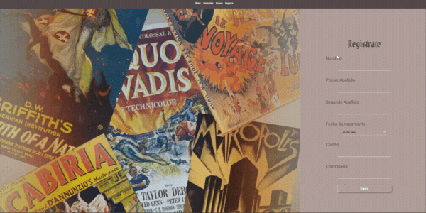
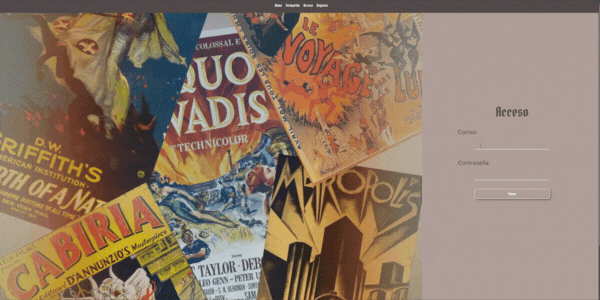
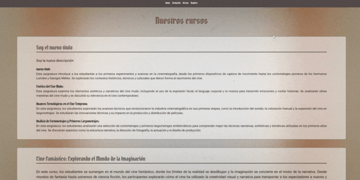
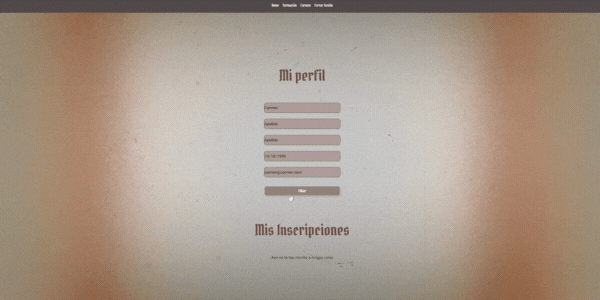

<h1 align="center"> FINAL PROJECT BACKEND: GORGONEYE CINEMA ACADEMY </h1>

<p align="center">
  
</p>


## Table of Contents :file_folder:

1. [Description :classical_building:](#description-classical_building)
2. [Stack :gear:](#stack-gear)
3. [Project :open_book:](#project-open_book)
4. [Functionalities :star2:](#functionalities-star2)
5. [Author :wave:](#author-wave)
6. [Acknowledgments :sparkling_heart:](#acknowledgments--sparkling_heart)

---

## Description :classical_building:
Gorgoneye Cinema Academy is an online platform dedicated to providing free courses in the realm of film studies. Aspiring filmmakers and cinephiles alike can delve into a variety of courses covering topics such as the history of cinema and cinematographic techniques. Our platform aims to democratize access to film education, fostering a community where users can enhance their understanding of the art and craft of filmmaking from anywhere in the world.

Features:
- Free Courses: Gain access to a diverse range of courses without any cost barrier.
- User Registration: Register and create an account to enroll in courses and track your progress.
- History of Cinema: Explore the evolution of cinema through comprehensive historical lessons.
- Cinematographic Techniques: Learn the fundamentals and advanced techniques used in filmmaking.
- Interactive Learning: Engage with interactive content and multimedia resources to enhance your learning experience.
- Community Interaction: Connect with fellow film enthusiasts, share insights, and collaborate on projects.
- Accessible Anywhere, Anytime: Access courses and resources from the comfort of your home, on your schedule.

---

## Stack :gear:

<div align="center">


</div>

---

## Project :open_book:


### 1 - Local Installation:

- Clone repository.
- Install all the dependencies on the project
```bash
npm install
```
- - Project backend: https://github.com/MartaGBayona/final-project-backend.git
```bash
npm run dev
```


### 2 - Info to log

- Director:

```json
  name: "Director",
  email: "director@director.com",
  password: "123456",
  role: "director"
```

- Student:

```json
  name: "Alumno",
  email: "alumno@alumno.com",
  password: "123456",
  role: "student"
```

### 3 - Roots:

1. Home:

<p align="center">
  
</p>

2. Register

<p align="center">
  
</p>

3. Log

<p align="center">
  
</p>

4. Courses

<p align="center">
  
</p>

4. Profile

<p align="center">
  
</p>

5. Courses with role director

<p align="center">
  
</p>

5. Users with role director

<p align="center">
  
</p>

---

## Functionalities :star2:

:white_check_mark: Register new users

:white_check_mark: Logging users

:white_check_mark: View all courses

:white_check_mark: View all subjects on courses

:white_check_mark: Edit user profile

:white_check_mark: Inscription on course by student

:white_check_mark: Delete inscription by user

:white_check_mark: Edit course by director

:white_check_mark: Create course by director

:white_check_mark: Delete course by director

:white_check_mark: Create subject on course by director

:white_check_mark: View all users on db by director

:white_check_mark: Delete users by director

:white_check_mark: Delete user found by input by director

:black_square_button: View all inscription by director

:black_square_button: Delete inscriptions by director

:black_square_button: Edit subjets by director

:black_square_button: Up document to subjet by student

:black_square_button: Create evaluation note by teacher

:black_square_button: Dynamic calendar with class dates


---

## Author :wave:

[GitHub](https://github.com/MartaGBayona) - [LinkedIn](https://www.linkedin.com/in/martagbayona/)

---

## Acknowledgments  :sparkling_heart:

My deepest gratitude to all my colleagues at GeeksHubs Academy.

---

<div align="center">
<a href="#table-of-contents-file_folder">🔼 Back to top 🔼</a>
</div>
